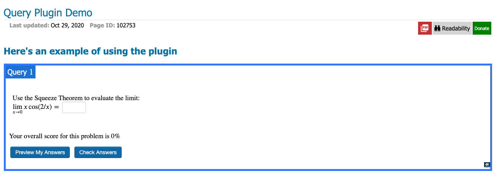
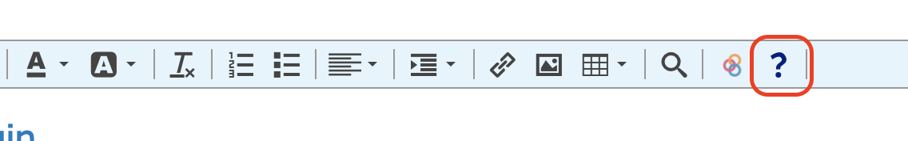

# CKEditor Query and Adapt Plugin

Libretexts tool for creating embedded problems in textbooks.

### Installation

```
yarn install
```

### Start Dev Server

```
yarn start
```

### Build Prod Version

```
yarn build
```

### Deploy to Test Site

```
yarn deploy:test $BRANCH_NAME
```

And find test page [here](https://query.libretexts.org/Development/Query_Plugin_Demo)

### What does this plugin do?

This plugin is used specifically on Libretexts only. The Query plugin embeds an interactive problem in the textbook by adding the following html/js code:

```html
<div class="box-query">
  <p class="box-legend"><span>Query \\(\\PageIndex{1}\\)</span></p>
  <p class="mt-script-comment">Embed QUERY Assessment</p>
  <pre class="script">template('query',{'PageID':'${pageId}'});</pre>
</div>
```

The javascript code `template('query',{'PageID':'${pageId}'});` is managed by the Libretexts side when the textbooks are rendered. This plugin only places the HTML into the textbook and nothing else.

If the `pageId` is valid, you should see something like this:



Similarly, the Adapt plugin embeds an interactive problem in the textbook by adding the following html/js code:

```html
<div class="box-query">
    <p class="box-legend"><span>ADAPT \\(\\PageIndex{1}\\)</span></p>
    <p class="mt-script-comment">Embed ADAPT Assessment</p>
    <pre class="script">template('adapt/Activity',{'ID':'${adaptID}'});</pre>
</div>
```

The javascript code `template('adapt/Activity',{'ID':'${adaptID}'})` is managed by the Libretexts side when the textbooks are rendered. This plugin only places the HTML into the textbook and nothing else.

If the `ID` is valid, you should see something like this:

[uncertain-what-to-use.png]

### How to use the plugin?

In the editor view, the question mark logo on the editor toolbar will access the Query plugin, while the circular arrows will access the Adapt plugin:



Clicking on either will open a new dialog that prompts you to enter a number which is the `pageId` (Query) or `ID`(Adapt) for the interactive problem to embed. Then, you can click OK and the HTML will be inserted into the editor.

### How to understand the code

Most important code is located in `./src/scripts/plugin.js`. You can follow the [official tutorial](https://ckeditor.com/docs/ckeditor4/latest/guide/plugin_sdk_sample_1.html) to understand each part.

